# Домашнее задание к занятию "Что такое DevOps. СI/СD" - Варфоломеева Марьяна

### Задание 1

Все задания были выполнены на виртуальной машине c CentOS 7 из предыдущего  ДЗ (Подъём инфраструктуры в Yandex Cloud).

На ВМ был установлен jenkins и проведены тесты и сборки проекта на go.

Ниже настройки проекта Freestyle Project Jenkins:

 - указана ссылка на гитхаб с проектом
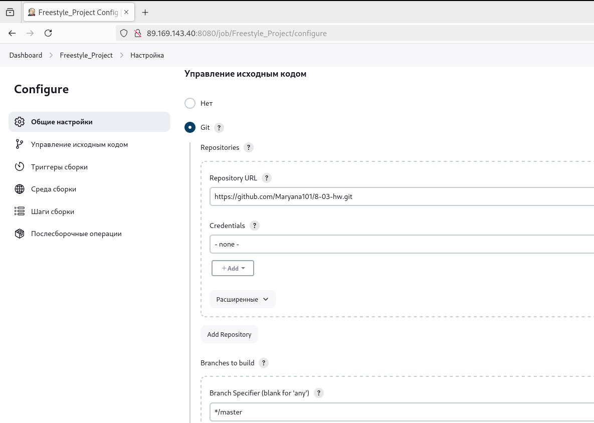

 - и команды shell
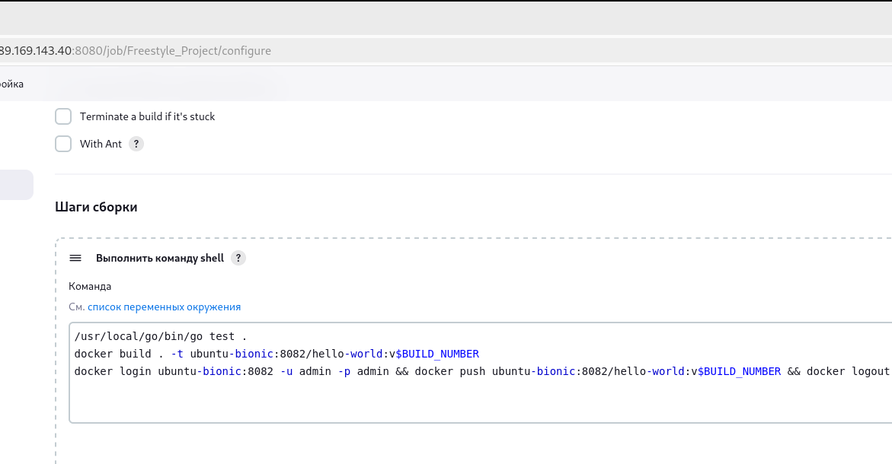

 - в nexus был создан репозиторий:
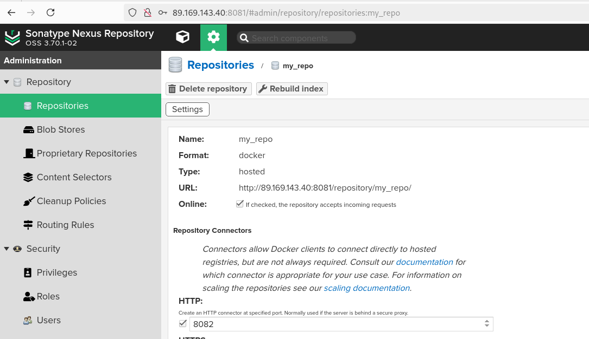

**Результат выполнения теста и сборки на Jenkins:**
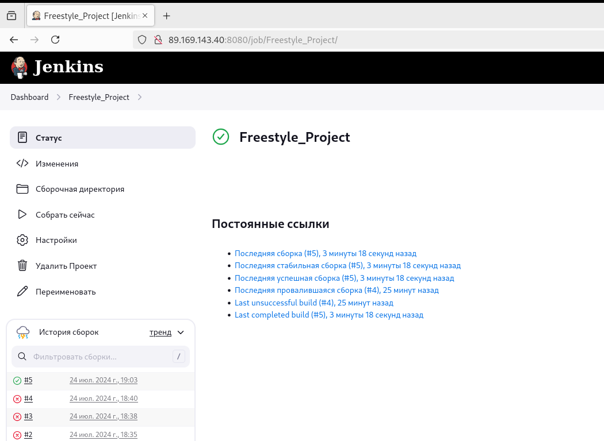

в nexus был загружен проект с номером сборки:
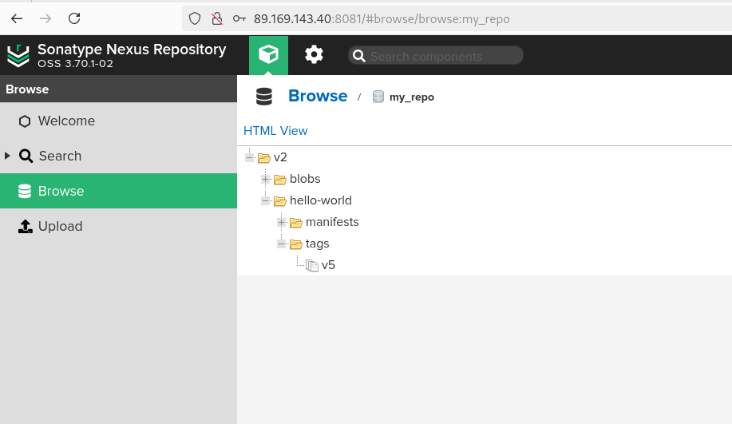

### Задание 2

Создать pipeline project, подготовить pipeline-скрипт для выполнения теста и сборки проекта.

В настройках проекта добавлен скрипт:
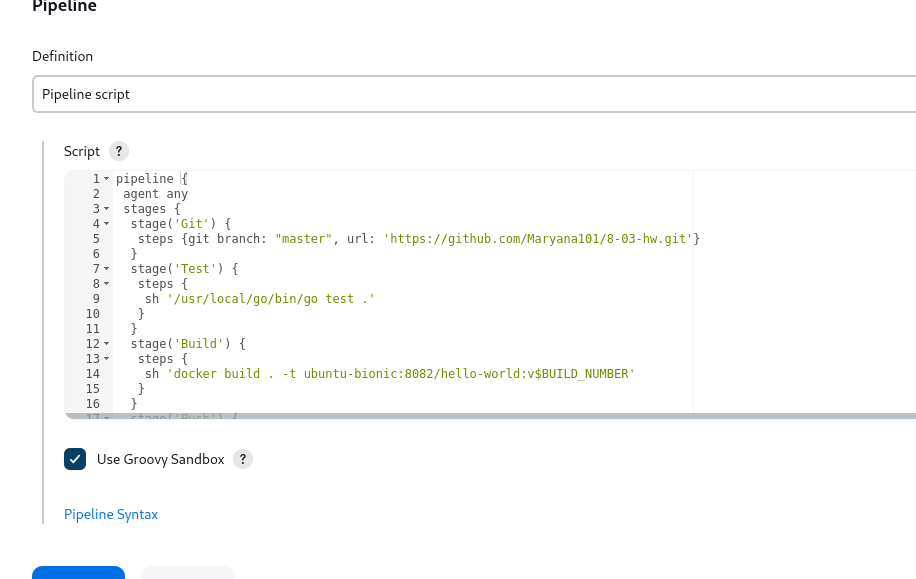

**Результат:**
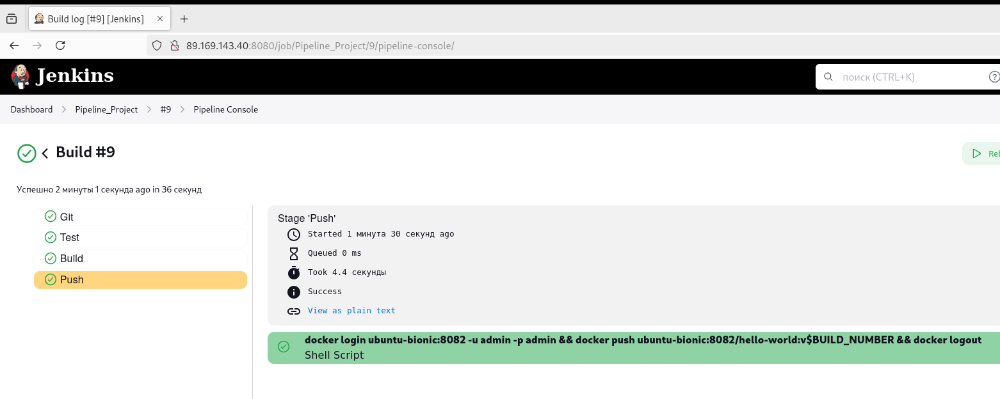

в nexus также видно, что сборка обновилась:
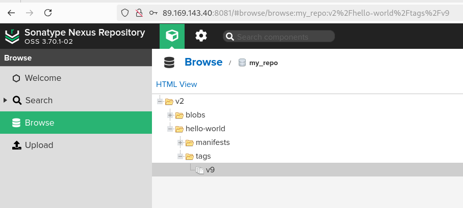

### Задание 3

Изменить pipeline так, чтобы вместо Docker-образа собирался бинарный go-файл.

В новом pipeline проекте добавлен обновленный скрипт:
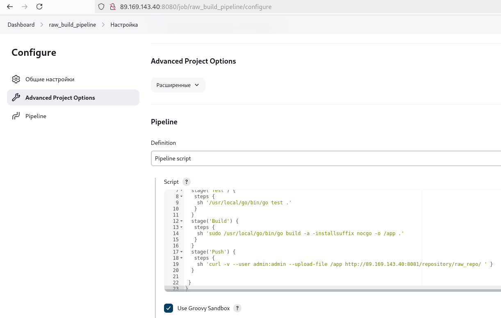

**Результат выполнения:**

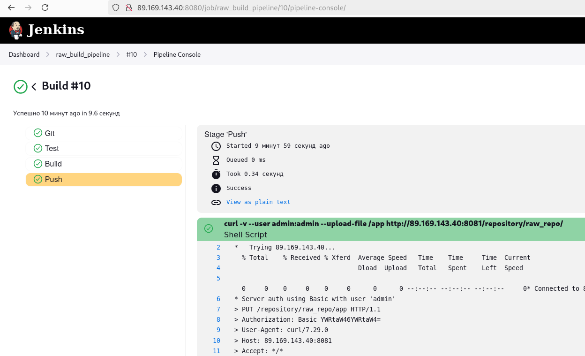

В репозиторий nexus был загружен файл:
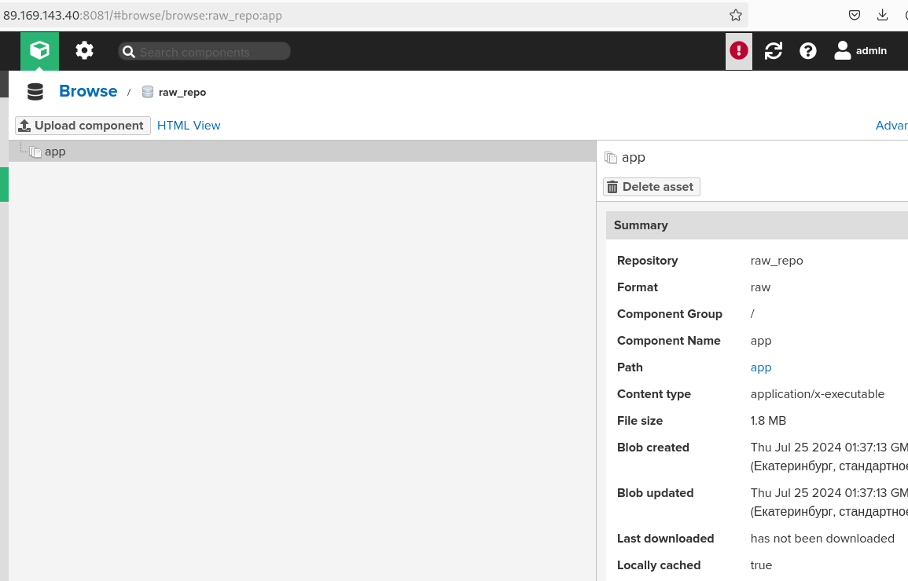

